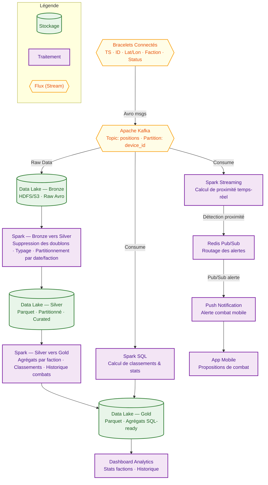

# Global Fighting Guild Tournament — Architecture Data

## Contexte du projet

Le **Global Fighting Guild Tournament** est un jeu de combat en temps réel reposant sur des **bracelets IoT connectés** portés par les joueurs. Chaque bracelet émet en continu des données de positionnement GPS ainsi que des métadonnées (identifiant du device, faction du joueur, statut). Une application est également installée sur le téléphone de l'utilisateur, permettant de le notifier lorsqu'un combat est déclenché

L'enjeu de l'architecture est multiple :

- **Temps réel** : détecter quand deux joueurs de factions adverses sont suffisamment proches pour déclencher un combat, et alerter leurs applications mobiles en quelques secondes
- **Analytics long terme** : stocker et agréger l'ensemble des événements de jeu (combats, déplacements, stats par faction) pour alimenter un dashboard.

---

# Réponses aux questions préliminaires

## 1.a — Contraintes techniques/business pour le stockage (Statistics / Analytics long terme)

Le service d'analytics long terme doit :

- Stocker un volume important de données (200 Go/jour × millions de devices = volume croissant rapidement)
- Supporter des requêtes analytiques agrégées (stats par faction, historique de combats)
- Garantir une durabilité des données sur le long terme
- Tolérer une cohérence éventuelle (pas besoin d'instantanéité pour les rapports de combats etc...)
- Être scalable horizontalement à moindre coût
- Supporter des formats orientés colonne pour optimiser les lectures.

---

## 1.b — Composants nécessaires pour le stockage analytique

Un **Data Lake (bronze/silver/gold)** basé sur un stockage objet distribué (S3, HDFS, Azure Blob) combiné à un moteur de traitement batch type **Spark** pour les agrégations.

---

## 2.a — Contraintes business pour le service Alert

Le service d'alerte doit :

- Être presque en temps-réel (la détection d'un combat entre deux joueurs doit être rapide : 10 à 15s)
- Avoir une haute disponibilité (AP selon le CAP theorem)
- Traiter des petits messages fréquents (positions GPS par les bracelets toutes les 15s)
- Supporter le **fan-out** : un événement de position peut déclencher une comparaison avec N autres joueurs à proximité

---

## 2.b — Composant pour l'alerte

**Redis** est utilisé comme canal de communication pour le service d'alerte, pour les raisons suivantes :
- **Réactif**: Redis est un outil qui est très réactif. Il y a peu de délai.
- **Pub/Sub natif** : Redis permet de publier une alerte sur un channel et de notifier tous les abonnés instantanément, idéal pour le fan-out
- **AP par nature** : Redis privilégie la disponibilité, cohérent avec le choix AP pour les alertes

### Architecture complète du projet 

